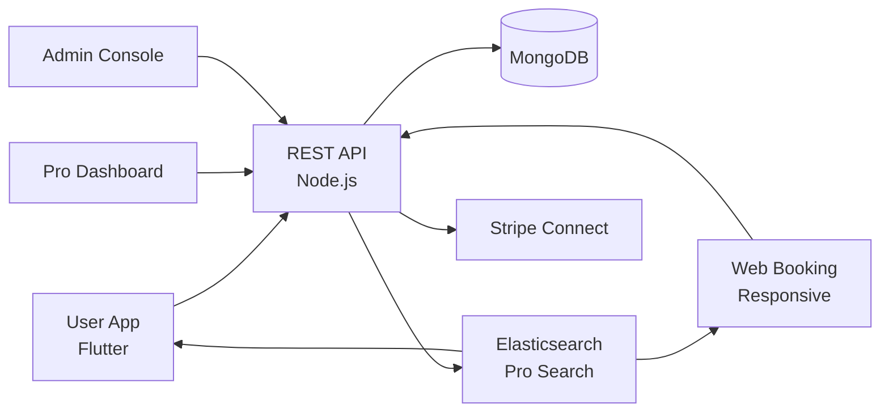

# Uber For Massage Clone — White-Label On-Demand Service Marketplace Platform by Miracuves

**MXSpa** is a production-ready, white-label Uber For Massage clone: a complete on-demand service marketplace with user, pro, and admin panels — delivered with **100% source code ownership** in **6 working days**.

> 🛠️ **See it running before you talk to anyone.** Live user app, pro dashboard, and admin console — demo credentials are printed on the [solution page](https://miracuves.com/uber-for-massage#demo). No sales call required.

---

## 🚀 Live Demos

| Environment | URL | What you can test |
|---|---|---|
| 📱 User App | [mas.mimeld.com](https://mas.mimeld.com) | Book, track, pay, rate service pro |
| 🌐 Web Booking | [mxspa.mimeld.com](https://mxspa.mimeld.com) | Full marketplace experience in browser |
| 🔧 Pro Dashboard | [Solution page → Demo](https://miracuves.com/uber-for-massage#demo) | Jobs, schedule, earnings, payouts |
| 🛠️ Admin Console | [Solution page → Demo](https://miracuves.com/uber-for-massage#demo) | Pros, categories, commissions, analytics |

Demo credentials for all environments: **[miracuves.com/uber-for-massage → Demo section](https://miracuves.com/uber-for-massage/#demo)**

---

## ✨ What Makes This Uber For Massage Clone Different

Most on-demand scripts stop at "search a pro." This platform ships with the features that actually run a service *marketplace*:

- **AI Quote Engine** — auto-generates quote ranges based on job description, location, time, and pro rates — what Thumbtack and TaskRabbit do
- **Multi-Category Marketplace** — cleaning, handyman, wellness, tutoring, beauty — same onboarding, same wallet, different taxonomy
- **Background-Checked Pros** — ID + background checks pre-onboarding — what consumers actually pay premium for
- **Recurring-Booking Engine** — weekly/bi-weekly housecleaning, dog walks, tutoring — drives LTV
- **Two-Way Ratings** — users rate pros, pros rate users — same trust mechanics Uber pioneered

## 📦 Core Features

**User:** search & category browse · pro profiles · reviews · instant booking · live tracking · secure payment · rebook

**Pro / Service Provider:** profile & specialisation · job inbox · schedule management · quote builder · earnings dashboard · payouts

**Admin:** pro onboarding · category management · commission engine · dispute resolution · analytics

## 🏗️ Architecture

**Stack:** Flutter mobile apps (Android + iOS) · Node.js backend · MongoDB · Stripe Connect for payouts · Elasticsearch for category search · Stripe Connect, regional gateways

## 📋 What’s Included

- ✅ Full source code — backend, web, mobile apps, panels (no encryption, no license locks)
- ✅ Deployment to your servers & app store submission assistance
- ✅ Your branding — white-label rename, logo, colors, domain
- ✅ 60 days post-launch support + 12 months of free updates
- ✅ Documentation & handover

**Pricing:** from **$3,699**, transparent on the [solution page](https://miracuves.com/uber-for-massage/#pricing) — no "contact us for quote" games.

## 🆚 Why Not Build From Scratch?

Custom on-demand platforms run $80k–$350k and 5–10 months. A proven white-label base gets you to market in 6 working days for a fraction of that, with your budget reserved for pro onboarding and growth marketing.

## 📚 Resources

- 📖 [Uber For Massage Clone — Full Solution Page](https://miracuves.com/uber-for-massage) (features, pricing, demos, FAQ)
- 💰 [How Much Does an On-Demand App Cost in 2026?](https://miracuves.com/uber-for-massage#pricing) pricing breakdown & what's included
- 📝 [Best Uber For Massage Clone Script in 2026](https://miracuves.com/uber-for-massage/blog/) features, pricing & launch guide
- 🧠 [Multi-Category Marketplace Mechanics](https://miracuves.com/uber-for-massage/blog/) services taxonomy, take rates
- ✅ [Miracuves Facts & Claims Ledger](https://miracuves.com/uber-for-massage/facts/) every claim we make, verified

## 🏢 About Miracuves

[Miracuves Solutions](https://miracuves.com) builds white-label clone apps and custom software from Mumbai, India — 90+ ready-made solutions, live demos for every product, transparent pricing, and delivery in 6 working days. Operating since 2010.

**Talk to us:** [WhatsApp](https://wa.me/919830009649) · [Schedule a consultation](https://miracuves.com/schedule-consultation/) · [miracuves.com](https://miracuves.com)

---

### ⚠️ Note on This Repository

This repository is a product overview. The full source code is delivered to clients on purchase — see [what’s included](https://miracuves.com/uber-for-massage/#included). For a hands-on evaluation, use the live demos above; credentials are public on the solution page.

*Keywords: uber for massage clone, uber for massage clone script, on-demand, local services, home services, white label Thumbtack, service marketplace, Flutter on-demand, Node.js marketplace*

---

<!--
══════════════════════════════════════════════════
TEMPLATE VARIABLE KEY — auto-generated from Netflix-Clone pattern
══════════════════════════════════════════════════
{APP_NAME}        Uber For Massage Clone
{MX_NAME}         MXSpa
{CATEGORY}        On-Demand Service Marketplace Platform
{DEMO_WEB}        mxspa.mimeld.com
{PRICE}           $3,699
{SLUG}            uber-for-massage
{SOLUTION_URL}    https://miracuves.com/uber-for-massage/
{VERTICAL}        on_demand

See /tmp/verticals/on_demand.txt for the vertical config used to generate this README.
══════════════════════════════════════════════════
-->