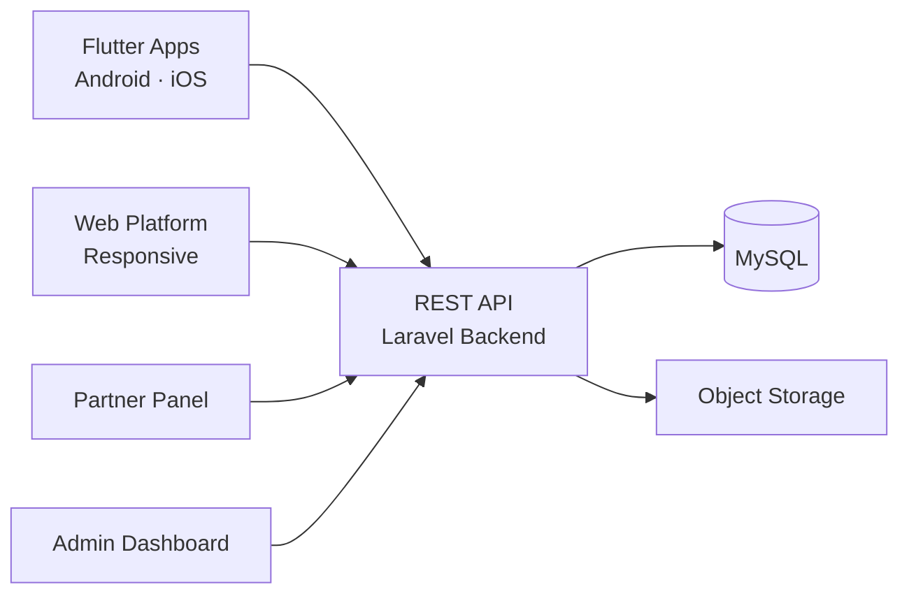

# Uber for Massage Clone — White-Label On-Demand Wellness by Miracuves

---

## Table of Contents

1. [Who Is This For?](#who-is-this-for)
2. [How It Works](#how-it-works)
3. [Core Features](#core-features)
4. [Architecture](#architecture)
5. [Revenue Streams](#revenue-streams)
6. [What's Included](#whats-included)
7. [Deployment Timeline](#deployment-timeline)
8. [Why Not Build From Scratch?](#why-not-build-from-scratch)
9. [Market Opportunity](#market-opportunity)
10. [Client Testimonials](#client-testimonials)
11. [FAQ](#faq)
12. [Resources](#resources)
13. [About Miracuves](#about-miracuves)

## Live Demos

| Environment | URL | What you can test |
|---|---|---|
| Web Platform | [mxspa.mimeld.com](https://mxspa.mimeld.com) | Full experience in the browser |
| Mobile App (Android) | [mas.mimeld.com](https://mas.mimeld.com) | Browse, transact, engage |
| Admin Dashboard | [Solution page → Demo](https://miracuves.com/uber-for-massage/#demo) | Users, content, plans, analytics |

Demo credentials: [miracuves.com/uber-for-massage -> Demo section](https://miracuves.com/uber-for-massage/#demo)

## What Makes This Uber for Massage Clone Different

<!-- TODO: fill 3-5 vertical-specific differentiators -->

## Who Is This For?

| Buyer Type | Use Case |
|---|---|
| Startup founders | Launch platform |
| Agencies | White-label solution |
| Enterprises | Custom deployment |

---

## How It Works

1. User opens app
2. Browses available services
3. Selects and customizes
4. Books/orders
5. Payment processed
6. Service delivered
7. Review & rating

---

## Core Features

### Customer
- Search therapists
- Book appointment
- Track arrival
- Pay
- Review

### Therapist
- Profile
- Schedule
- Accept jobs
- Earnings

### Admin
- Verification
- Zones
- Commissions

---

## Advanced Features

The platform integrates AI-powered features that reduce manual overhead and capture revenue opportunities:

- **AI Engine** - Smart automation
- **AI Recommendations** - Personalized suggestions

---

## Apps and Web Panels

| Module | Description |
|---|---|
| Customer | Book,pay |
| Therapist | Serve,earn |

---

## Architecture

**Stack:**

| Layer | Technology |
|---|---|
| Mobile | Flutter |
| Backend | Node.js |
| Database | MongoDB |
| Payments | Stripe |

---

## Revenue Streams

The platform is engineered to generate revenue from day one through multiple complementary channels:

- Transaction fees
- Subscription plans
- Commission per booking
- Featured listings
- Premium features

---

## Security and Compliance

- OTP-based authentication
- SSL/TLS encrypted API communication
- GDPR-ready data handling

---

## What's Included

| Plan | Price | What You Get |
|---|---|---|
| Standard | **$$6,699** | Complete source code, all apps, admin panel, rebranding, 1 year updates |
| Enterprise | Custom Quote | Everything in Standard + custom features, multi-region, priority support |

**What is included:**

- Customer
- Therapist
- Full Source Code
- Complete Rebranding (your logo, colors, app name)
- Server Deployment
- App Store and Google Play Submission Support
- 60 Days Free Bug Support
- Free 1-Year Updates

---
**Pricing:** from **$3,699** — transparent on the [solution page](https://miracuves.com/uber-for-massage/#pricing).

## Deployment Timeline

| Day | Milestone |
|---|---|
| Day 1 | Server setup, environment configuration, initial deployment |
| Day 2 | White-labeling - app name, logo, colors, splash screens |
| Day 3 | Payment gateway integration + third-party API configuration |
| Day 4 | Custom feature implementation (if applicable) |
| Day 5 | QA, testing, bug fixes across all panels |
| Day 6 | App Store + Google Play submission + Go-live |

> **Average go-live: 6 business days from payment confirmation.**

---

## Why Not Build From Scratch?

| Factor | Build from Scratch | Miracuves Solution |
|---|---|---|
| Time to Launch | 6-12 months | 6 days |
| Development Cost | $60,000-$150,000 | From $$6,699 |
| Source Code Ownership | Yes | Yes |
| Customization | Full | Full |
| Post-Launch Support | Depends on team | 60 days included |
| Risk | High | Low |

---

## Market Opportunity

| Metric | Data |
|---|---|
| Large Market | Growing |

> Source: Statista, Grand View Research, Allied Market Research

---

## Successful Verticals

- Massage therapy
- Spa services
- Wellness
- Personal training
- Beauty services

---

## Client Testimonials

> *"Launched in 6 days. Exceptional quality."*
> - Founder

> *"Source code ownership gave us full control."*
> - CEO

---

## FAQ

**How much?**
See pricing.

**Source code?**
Yes.

**Launch?**
6 days.

**Rebrand?**
Yes.

**Support?**
60 days.

---

## Related Solutions

Explore our other white-label clone solutions:

- [UrbanClap Clone](https://github.com/Miracuves-Solutions/urbanclap-clone)
- [Uber for X](https://github.com/Miracuves-Solutions/uber-for-x)
- [Thumbtack Clone](https://github.com/Miracuves-Solutions/thumbtack-clone)

---

## Resources

- [Full Solution Page](https://miracuves.com/uber-for-massage/) — features, pricing, demos, FAQ

## Get Started

**Ready to launch your on-demand wellness marketplace?**

| Channel | Link |
|---|---|
| Full Solution Page | [miracuves.com/uber-for-massage](https://miracuves.com/uber-for-massage/) |
| Email | info@miracuves.com |
| WhatsApp | [+91 98300 09649](https://wa.me/919830009649) |
| Book a Call | [Free Consultation](https://miracuves.com/contact/) |

---

## About Miracuves

**Miracuves Solutions Pvt. Ltd.** is a Mumbai-based software company specializing in white-label clone app solutions across 12+ industries.

- 90+ ready-to-deploy solutions
- 6-day delivery guarantee
- 60+ engineers on staff
- 3,900+ apps delivered
- Full source code ownership
- Clients across 40+ countries including India and USA

[Explore all 90+ solutions at miracuves.com](https://miracuves.com)

---

## Disclaimer

This product is independently developed by Miracuves. All product names, logos, and brands are property of their respective owners. Use of these names does not imply endorsement.

---

*(c) 2026 Miracuves Solutions Pvt. Ltd. | Mumbai, India*
*This repository contains product documentation only - no proprietary source code is published here.*

*Keywords: uber for massage clone, uber for massage script, white label solution, laravel flutter app, clone script*

---

### Note on This Repository

This repository is a product overview. The full source code is delivered to clients on purchase. For a hands-on evaluation, use the live demos above; credentials are public on the solution page.

<!--
=========================================================
GENERATED FROM MIRACUVES NETFLIX-CLONE README TEMPLATE
Canon: 6 working days, from $2,799 floor, 60 days support + 12 months updates.
Never use 3 days. See https://miracuves.com/facts/ for audited claims.
=========================================================
-->
